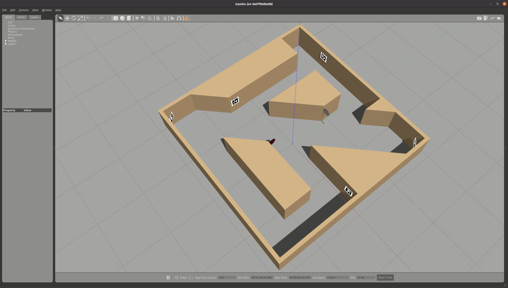

# TMMC_Fleet_Control_Challenge

## Description
This project houses the necessary software, simulation tools and code scaffolding for the TMMC Fleet Control Challenge. The challenge is to navigate TurtleBots in a known manufacturing-like environment (12ft x 12ft field made by the IDEAs Clinic) while avoiding other TurtleBots/obstacles and adhereing to signage on the field.

## Usage and Installation Details

To run the simulation:
1. `cd simulation_files`
2. `./install_sim_files.sh`
3. `ros2 launch turtlebot_tic_world.launch.py`

Note: if you want to use a TurtleBot with a camera, please type `export TURTLEBOT3_MODEL=waffle_pi` in your terminal before running step 3 above. By default the environment variable `TURTLEBOT3_MODEL` is set to `burger` which only has a LiDAR.

You should see a TurtleBot 3 model spawned in the Gazebo simulator along with a model of the Toyota Innovation Challenge field setup. You can use the TMMC_Wrapper to interface with this simulated robot.

## Timeline

## Authors and acknowledgment
Maintained by: Sagar, Leo, Richard (EngineeringIdeasClinic)

## License
No license currently.

## Project status
Currently in the early stages of development.
